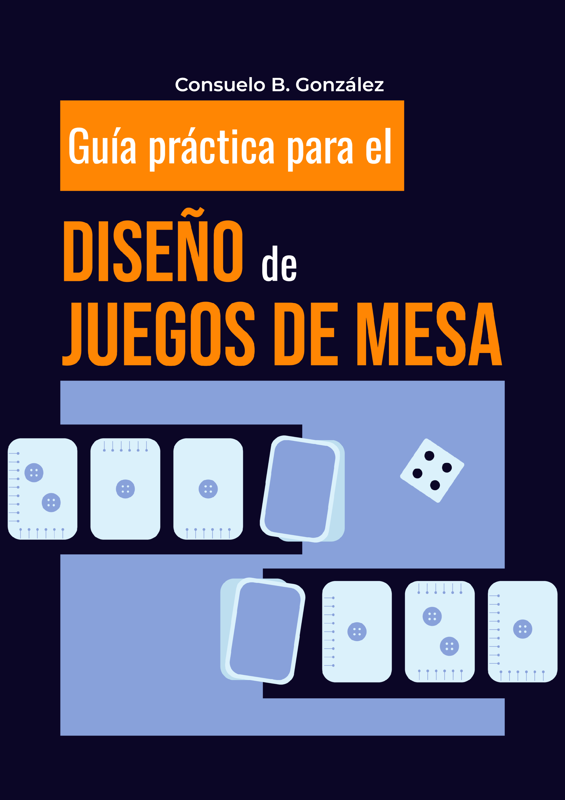

# guia-diseno-juegos-mesa
Guía práctica para el diseño de juegos de mesa orientada a evitar la desidia lúdica.
# Guía práctica para el Diseño de Juegos de Mesa
ℹ️ Nota: GitHub puede no mostrar correctamente la vista previa del PDF.
Para ver el contenido completo, descarga el archivo.

Esta guía es una herramienta práctica orientada a diseñadores y diseñadoras de juegos de mesa,
especialmente enfocada en prevenir la desidia lúdica durante la experiencia de juego.

El documento surge a partir de un proyecto de título en Diseño y se basa en la observación,
el análisis de juegos existentes y la experiencia práctica de diseño.

## 📥 Descarga
👉 [Descargar la guía en PDF](Guia_Diseno_Juegos_Mesa.pdf)
ℹ️ Para ver correctamente la guía, descarga el PDF.

## 📌 Contenidos
- Claridad de reglas
- Accesibilidad y lectura
- Diseño de componentes
- Ritmo de juego
- Experiencia del jugador

## 📄 Licencia
Este material es de acceso gratuito y puede ser compartido con fines educativos.
